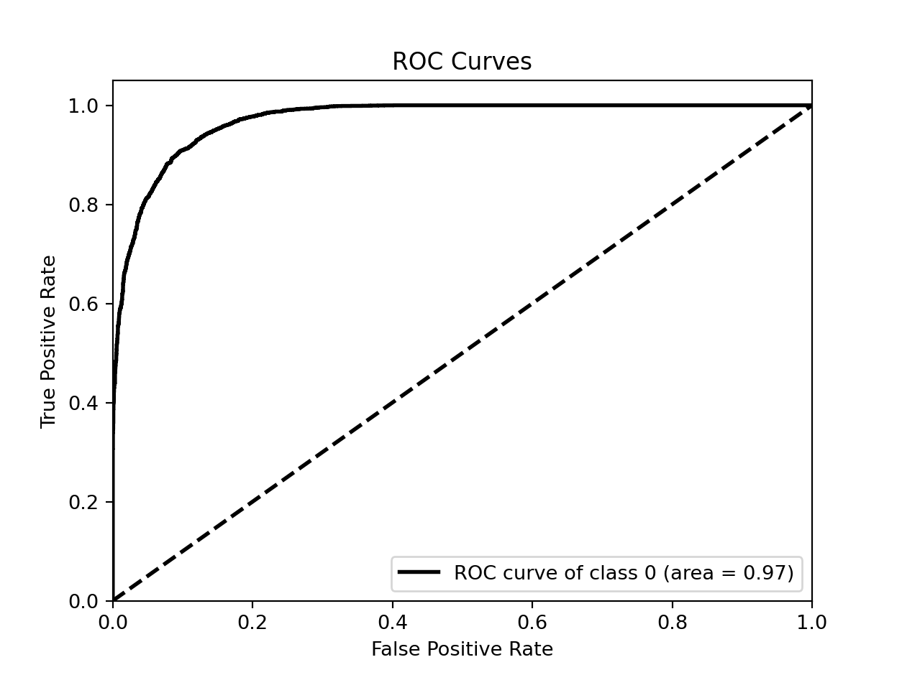
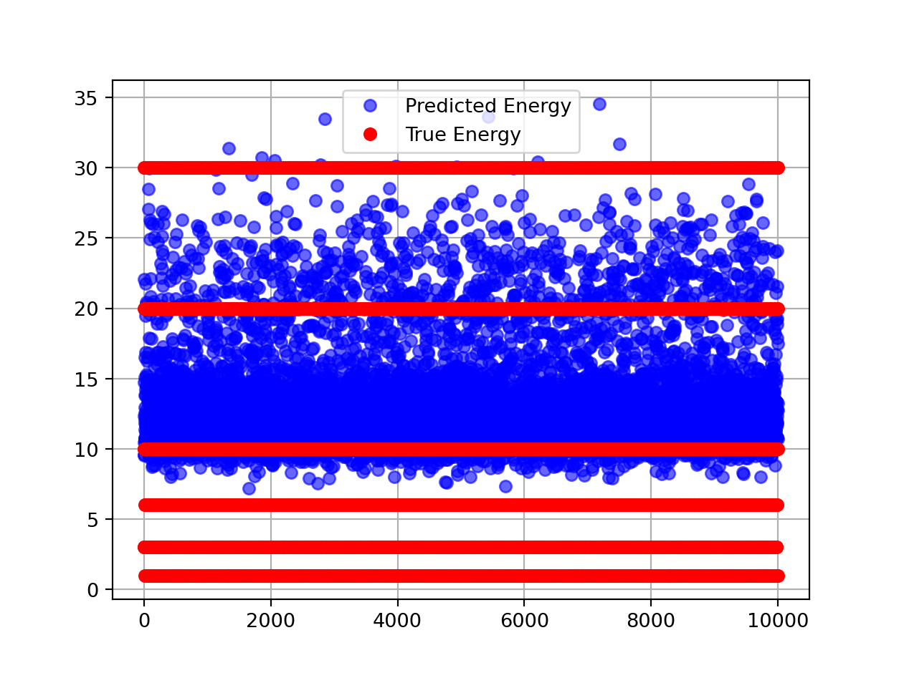
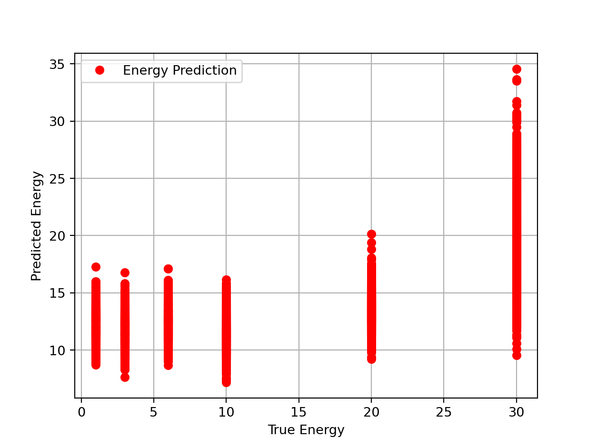
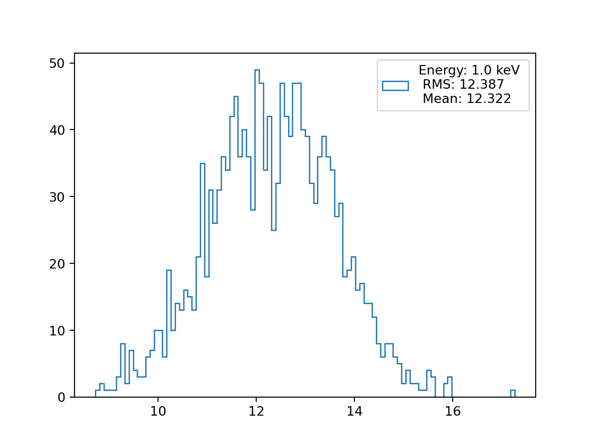
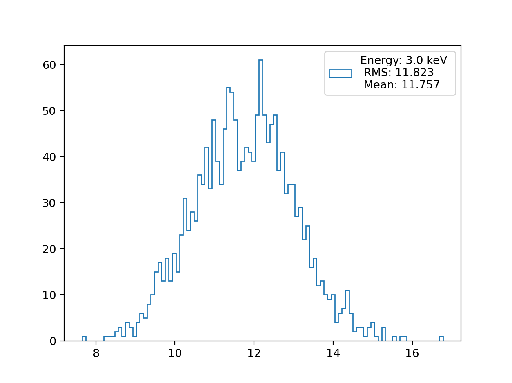
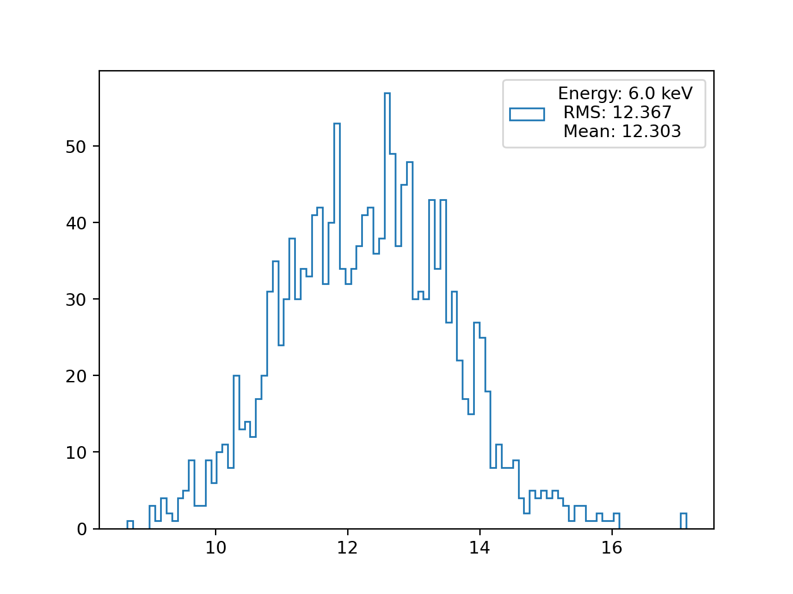
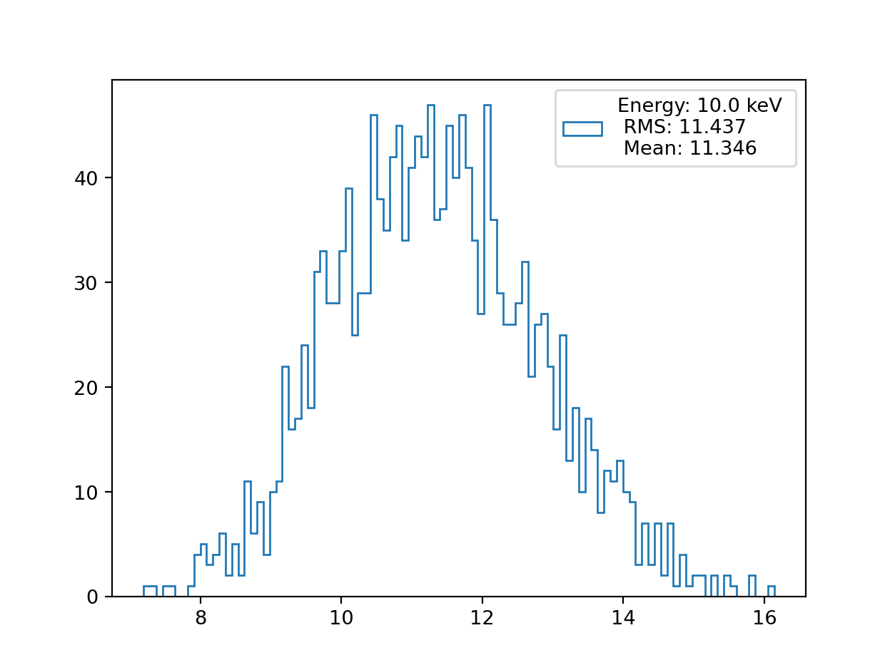
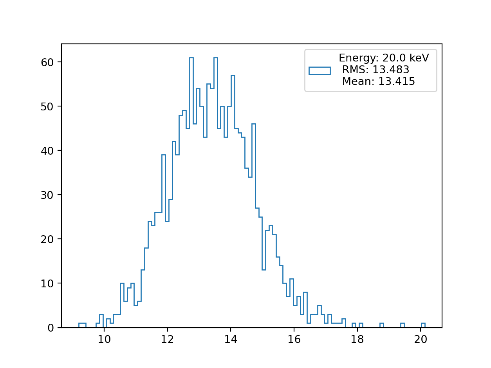

# IDAO-21 Baseline

## FAQ

- Why I can't install new packages?

There is no internet connection in the submission instance.

- What packages are installed in the Yandex Contest instance?

```
pytorch, torchvision, numpy, scipy, pandas, scikit-learn,
joblib, tqdm, ipython, cython, numba, statsmodels, pqdict, xlearn,
ml_metrics, tsfresh, mlxtend, h5py, tempita, xgboost, lightgbm, catboost,
tensorflow, keras, pytorch-lightning
```

- I need package `foo` and it's absolutely important, what can I do?

If your soultion relies on the package entirely you may submit a pull request of
ask to add it directly.

## Dataset

Dataset is available for download through Yandex disk ->
[Click here](https://yadi.sk/d/UJ8DEma9LHRMsg).

Each directory contain images in `.png` format, the filename contain the class
label information.

```
_dataset/
├── private_test
│   └── *.png
├── publis_test
│   └── *.png
└── train
    ├── ER
    └── NR

```

Each directory contain bunch of images the image name contain the class label
and other informaion. The most important part is the class label which is in
{1.0, 3.0, 6.0, 10.0, 20.0, 30.0} and has `_keV` suffix.

```
0.00012752991074573__CYGNO_60_40_ER_30_keV_930V_30cm_IDAO_iso_crop_hist_pic_run4_ev846;1.png
0.0001805024851534__CYGNO_60_40_ER_10_keV_930V_30cm_IDAO_iso_crop_hist_pic_run2_ev317;1.png
0.00013557143164375__CYGNO_60_40_ER_10_keV_930V_30cm_IDAO_iso_crop_hist_pic_run2_ev842;1.png
0.00019057084775703__CYGNO_60_40_ER_3_keV_930V_30cm_IDAO_iso_crop_hist_pic_run2_ev116;1.png
0.0001135022106767__CYGNO_60_40_ER_10_keV_930V_30cm_IDAO_iso_crop_hist_pic_run5_ev136;1.png
0.0001275016178883__CYGNO_60_40_ER_3_keV_930V_30cm_IDAO_iso_crop_hist_pic_run2_ev485;1.png
0.0001375808674508__CYGNO_60_40_ER_30_keV_930V_30cm_IDAO_iso_crop_hist_pic_run3_ev662;1.png
0.0011665058173393__CYGNO_60_40_ER_10_keV_930V_30cm_IDAO_iso_crop_hist_pic_run5_ev574;1.png
0.0011465791675372__CYGNO_60_40_ER_3_keV_930V_30cm_IDAO_iso_crop_hist_pic_run2_ev114;1.png
0.0011065850424555__CYGNO_60_40_ER_3_keV_930V_30cm_IDAO_iso_crop_hist_pic_run4_ev868;1.png
```

#### Data spliting

The total number of samples in the dataset is ~30k sample distributed with 2
classes ER=0 and NR=1. The dataset are interleaved in the following scheme:

##### Interleave the files

| Energy | He  | e   |
| ------ | --- | --- |
| 1      | \*  | -   |
| 3      | -   | \*  |
| 6      | \*  | -   |
| 10     | -   | \*  |
| 20     | \*  | -   |
| 30     | -   | \*  |

- is training; - is testing

### Dataset distribution

## Training

If you want to retrain the model just run:

```
mv checkpoints checkpoints_bk && python train.py
```

This will move the original checkpoints and run the experiment again. Note you
can modify `config.ini` to loader the checkpoint without moving the files.

## Results

To generate the report just run:

```
python report.py
```

This will generate `./resultsreport.log` in the current directory containg
information and bunch of plots in the `./results/` directory

### Score

## Score = MAE - AUC

### Classification

## 

### Regression

 
 
 
 

# Submission

To generate `submission.csv` run:

```
python generate_submission.py
```

And then zip your solution

```
zip -r submission.zip foo/*
```
